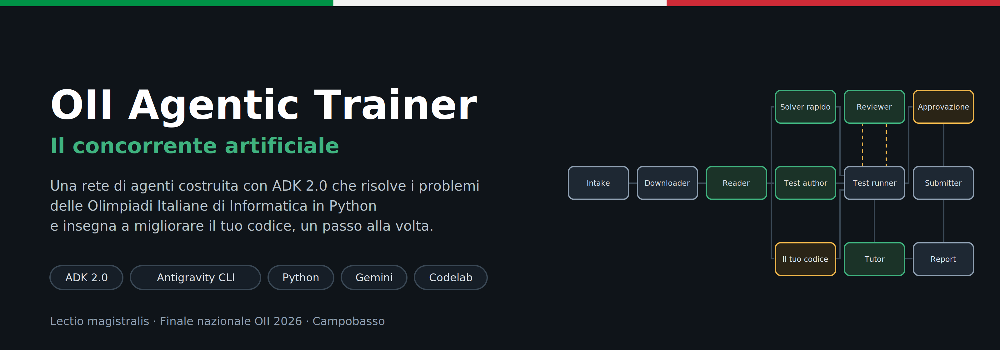
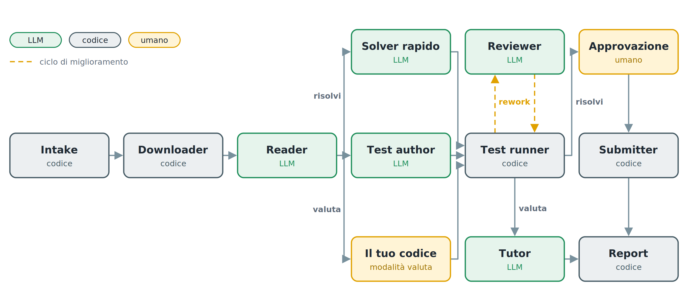

# OII Agentic Trainer · Il codelab

Costruisci a casa, un prompt alla volta, una rete di agenti con [ADK 2.0](https://adk.dev) e Antigravity CLI che risolve i problemi delle Olimpiadi Italiane di Informatica in Python e insegna a migliorare il tuo codice.

È il laboratorio della lectio «Il concorrente artificiale», finale nazionale OII 2026 a Campobasso.

**▶ [Apri il codelab](https://nicolaguglielmi.github.io/OII-Agentic-Trainer-Codelab/)** · **[Slide della lectio](slides/il-concorrente-artificiale.pdf)**

## Partenza rapida

Ti servono macOS o Linux (su Windows, WSL), Python 3.10+ e una [chiave API di Gemini](https://aistudio.google.com/app/apikey). Installa [Antigravity CLI](https://antigravity.google/docs/cli/install/):

```console
curl -fsSL https://antigravity.google/cli/install.sh | bash
```

In alternativa puoi usare [Claude Code](https://code.claude.com/docs/en/setup) (`curl -fsSL https://claude.ai/install.sh | bash`, richiede un piano Claude a pagamento): legge lo stesso `AGENTS.md` e i prompt del codelab sono identici.

Poi prepara il progetto con lo starter kit e installa ADK in un ambiente virtuale:

```console
git clone https://github.com/nicolaguglielmi/OII-Agentic-Trainer-Codelab.git
mkdir oii-solver
cp OII-Agentic-Trainer-Codelab/starter/AGENTS.md OII-Agentic-Trainer-Codelab/starter/CONTINUA.md oii-solver/
cp OII-Agentic-Trainer-Codelab/starter/env.esempio oii-solver/.env
cd oii-solver
python3 -m venv .venv
source .venv/bin/activate
pip install "google-adk>=2.9" requests python-dotenv pymupdf
```

Metti la tua chiave in `.env`, avvia `agy` nella cartella con l'ambiente virtuale attivo e segui il codelab dal passo «Prepara il progetto». Se il lavoro si interrompe, scrivi ad agy «Segui CONTINUA.md»: riparte dal primo passo non completato.

## Cosa costruirai



Il principio è uno solo: **gli LLM propongono, il codice giudica**. Gli agenti leggono il testo, scrivono le soluzioni e le migliorano; esempi ufficiali, stress test contro una brute force e cronometro decidono se una versione è corretta e quanto vale.

* **`risolvi <task>`**: una prima soluzione corretta in pochi secondi, poi il Reviewer la migliora un passo alla volta, misurando ogni passo sui subtask. Alla fine, solo con la tua approvazione, l'invio al grader ufficiale.
* **`valuta <task>` + il tuo codice**: il tuo codice diventa la v1. Ottieni una review, una guida passo passo in cui ogni consiglio è una versione che ha superato i test, e un report visivo con i diff e i tempi.

Dieci passi più un collaudo finale senza rete, circa un'ora e mezza.

## Contenuto del repository

| Percorso | Cosa contiene |
|---|---|
| `starter/` | `AGENTS.md` (il file di contesto), `CONTINUA.md` (per riprendere) e `env.esempio` (modello del file `.env`) |
| `esempi/ois_rockpaperscissors/` | due soluzioni di partenza per provare la modalità `valuta` |
| `slides/` | le slide della lectio |
| `codelab/` | il sorgente del codelab in formato [claat](https://github.com/googlecodelabs/tools), le immagini e lo script di build |
| `docs/` | il codelab generato, pubblicato con GitHub Pages |

## Avvertenze

* L'API di training.olinfo.it non è documentata e il sito può cambiare: il downloader ripiega sulla pagina pubblica del task e, se serve, su un fallback locale in `fallback/<task>/` che prepari tu. Il testo dei problemi appartiene agli organizzatori delle Olimpiadi e non è incluso nel repository.
* Il sistema legge soltanto dal sito. Invia una soluzione solo con `OLINFO_DRY_RUN=0`, le credenziali nel `.env` e la tua conferma esplicita. Usa un account dedicato agli esperimenti, mai quello con cui gareggi: i punteggi finiscono in classifica.
* Il codice generato dagli agenti gira sulla tua macchina, in una cartella temporanea e con limiti di tempo e memoria. Non eseguire il progetto come root.

Hai trovato un errore nel codelab? Apri una [issue](https://github.com/nicolaguglielmi/OII-Agentic-Trainer-Codelab/issues).

## Per chi modifica il codelab

Dopo una modifica a `codelab/concorrente-artificiale.md`, rigenera il sito con [claat](https://github.com/googlecodelabs/tools/tree/main/claat) installato:

```console
./codelab/build.sh
```

Lo script rigenera `docs/`, usa le copie locali degli elementi del codelab in `codelab/vendor/` (il vecchio indirizzo `storage.googleapis.com/claat-public` non è più pubblico) e aggiunge le personalizzazioni di `codelab/theme/`. `starter/AGENTS.md` deve restare identico al blocco del passo «Il file di contesto».

## Licenza

Apache License 2.0: vedi [LICENSE](LICENSE). Gli elementi del codelab in `codelab/vendor/` sono di Google (Apache 2.0) e del progetto webcomponents (BSD): le licenze sono nella stessa cartella.
