author: [Nome Cognome]
summary: Con ADK 2.0 e Antigravity CLI costruisci una rete di agenti che risolve problemi delle Olimpiadi Italiane di Informatica in Python, migliora le soluzioni un passo alla volta e insegna a migliorare il tuo codice.
id: concorrente-artificiale-adk2
categories: ai,agents,adk,antigravity,olimpiadi
environments: Web
status: Published

# Il concorrente artificiale: una rete di agenti con ADK 2.0

## Panoramica
Duration: 0:04:00


In questo codelab costruisci, un prompt alla volta, una rete di agenti che affronta i problemi delle Olimpiadi Italiane di Informatica (OII) con il metodo di un concorrente: legge il testo, scrive una prima soluzione corretta, la mette alla prova contro una brute force e la migliora finché i subtask non entrano nei limiti di tempo.

La stessa rete ha una seconda modalità, pensata per chi si allena: carichi il tuo codice e ottieni una review, una guida passo passo per renderlo più veloce e una vista visiva di ogni correzione.

Non scriverai il codice a mano. Lo scriverà Antigravity CLI (`agy`) a partire da prompt precisi, guidato da un file di contesto. Il tuo lavoro è quello di un progettista: decidere il grafo, verificare ogni passo, capire cosa sta succedendo.

### Cosa costruirai


In verde gli agenti LLM, in grigio i nodi di codice, in giallo i punti in cui interviene una persona. Il tratteggio ambra è il ciclo di miglioramento tra Test runner e Reviewer.

La stessa rete lavora in due modalità: **risolvi**, che affronta un problema da zero, e **valuta**, che parte dal tuo codice e ti insegna a migliorarlo.

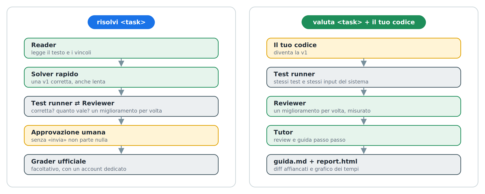

### Cosa imparerai

* Come si descrive un sistema multi-agente come **grafo** con ADK 2.0: nodi LLM, nodi di codice, fan-out, join, route e cicli.
* Perché conviene separare chi **propone** (gli LLM) da chi **giudica** (codice deterministico).
* Come far lavorare due agenti in modo **indipendente**, così che uno smascheri gli errori dell'altro.
* Come costruire un ciclo che migliora una soluzione **un passo alla volta**, guidato da misure e non da intuizioni.
* Come mettere un **umano nel ciclo** prima di un'azione nel mondo reale.
* Come fare vibe coding in modo controllato, con un file di contesto e una verifica a ogni passo.

### Cosa ti serve

* Un computer Linux o macOS con Python 3.10 o superiore.
* `google-adk` 2.9 o superiore già installato.
* Antigravity CLI (`agy`) installato e collegato al tuo account.
* Una chiave API di Gemini (Google AI Studio) o un progetto Vertex AI.
* Facoltativo: un account su training.olinfo.it dedicato agli esperimenti, se vuoi inviare le soluzioni al grader ufficiale.

<aside class="positive">
Il principio che guida tutto il codelab: <strong>gli LLM propongono, il codice giudica</strong>. Nessun agente decide da solo se una soluzione è corretta o veloce: lo decidono esempi, stress test e cronometro.
</aside>

## I concetti in cinque minuti
Duration: 0:05:00

Se hai fatto le Olimpiadi questi concetti li conosci già: qui li fissiamo, perché ogni nodo del grafo ne usa almeno uno.

### Subtask e complessità

Un problema OII è diviso in subtask: gli stessi problemi con vincoli sempre più grandi, ognuno con i suoi punti. Dai vincoli si capisce quale complessità serve. Una regola pratica:

| Vincolo su N | C++ (circa 10⁸ operazioni/s) | Python (circa 10⁷ operazioni/s) |
|---|---|---|
| N ≤ 20 | O(2ᴺ · N) | O(2ᴺ) |
| N ≤ 500 | O(N³) | O(N²) |
| N ≤ 5.000 | O(N²) | O(N log N) |
| N ≤ 10⁵ | O(N log N) | O(N log N) |
| N ≤ 10⁶ | O(N log N) | O(N) |

È una stima, non una legge, ma spiega perché in Python una soluzione con l'idea giusta può comunque perdere i subtask più grandi.

### La brute force

La brute force è la soluzione più ovvia: prova tutte le possibilità e tiene la migliore. È lentissima, ma è quasi impossibile sbagliarla, perché non contiene nessuna idea furba. Per questo fa da riferimento: sugli input piccoli conosce sempre la risposta giusta.

```python
# brute force: prova ogni sottoarray non vuoto, O(N²). Ovvia, quindi affidabile.
best = max(sum(a[i:j+1]) for i in range(n) for j in range(i, n))

# soluzione veloce: O(N), ma contiene un'idea, e quindi può contenere un errore
best = cur = float('-inf')
for x in a:
    cur = max(x, cur + x)
    best = max(best, cur)
```

### Lo stress test

Lo stress test mette una contro l'altra la soluzione e la brute force su tanti input piccoli e casuali. Se danno lo stesso output si passa al successivo; se no, la soluzione sbaglia, e quell'input è il **controesempio**.

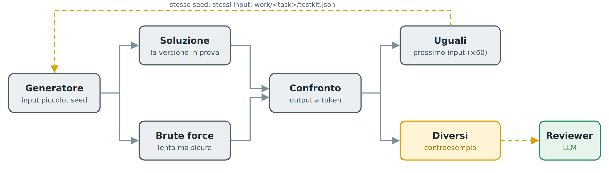

Gli input sono piccoli per due motivi: la brute force è lenta, e i bug veri stanno quasi sempre nei casi limite, che saltano fuori anche con pochi numeri.

### Il tabellone

Corretta non basta: quanto vale? Per ogni subtask si genera l'input più grande e si cronometra la soluzione contro il limite di tempo. Il **punteggio stimato** è la somma dei punti dei subtask che entrano nel limite.

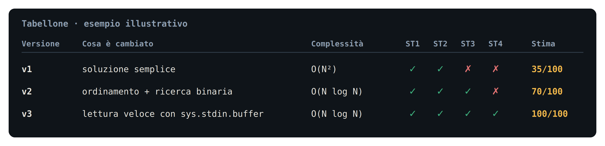

### Gli agenti come grafo

In ADK 2.0 un sistema multi-agente è un grafo. Ogni **nodo** è un agente LLM oppure una semplice funzione Python; gli **archi** dicono chi viene dopo chi; le **route** sono archi condizionali; un **ciclo** è un arco che torna indietro. Il principio del codelab: gli LLM propongono, il codice giudica.

## Prepara l'ambiente
Duration: 0:06:00

### Crea la cartella del progetto

```console
mkdir oii-solver && cd oii-solver
```

### Crea il file .env

Nella cartella crea un file `.env` con la tua chiave. `adk web` lo legge da solo all'avvio.

```console
GOOGLE_GENAI_USE_VERTEXAI=FALSE
GOOGLE_API_KEY=la-tua-chiave
FAST_MODEL=gemini-3.5-flash
STRONG_MODEL=gemini-3.5-flash
OLINFO_DRY_RUN=1
```

Se hai accesso a un modello più forte, mettilo in `STRONG_MODEL`: lo useranno il Reviewer e il Tutor.

### Scegli il problema

Apri la pagina dei problemi di training.olinfo.it (per anno, oppure Nazionali e OIS) e scegli un task, con un nome come `oii_*`, `preoii_*` o `ois_*`. Il nome è l'ultima parte dell'indirizzo della pagina del task. Nella pagina pubblica controlla due cose:

* **Input/output: stdin / stdout**;
* tra gli allegati c'è un template **.py**. È il segnale che Python è ammesso: l'elenco dei linguaggi si vede solo dopo il login.

Evita i task che richiedono un grader C/C++ senza un `grader.py`, e le Territoriali (`terry/`), che usano un altro sistema. Un esempio adatto: `ois_rockpaperscissors`.

Annota il nome: nel resto del codelab lo chiameremo `<task>`.

<aside class="negative">
I limiti di tempo delle OII sono tarati sul C++. In Python una soluzione con la complessità giusta può comunque sforare sui subtask più grandi. Per questo codelab è un vantaggio: vedrai il punteggio stimato salire versione dopo versione.
</aside>

### Configura agy

* Avvia `agy` dalla cartella del progetto.
* Con `/model` scegli il modello più forte disponibile per il tuo account.
* Imposta l'approvazione automatica delle modifiche ai file e lascia la conferma sui comandi shell: vedrai ogni comando prima che parta.

## Il file di contesto
Duration: 0:05:00

I modelli conoscono soprattutto la versione 1.x di ADK, basata su `SequentialAgent`, `ParallelAgent` e `LoopAgent`. ADK 2.0 introduce un motore a grafo con un'API diversa. Senza istruzioni, un coding agent tende a scrivere codice vecchio.

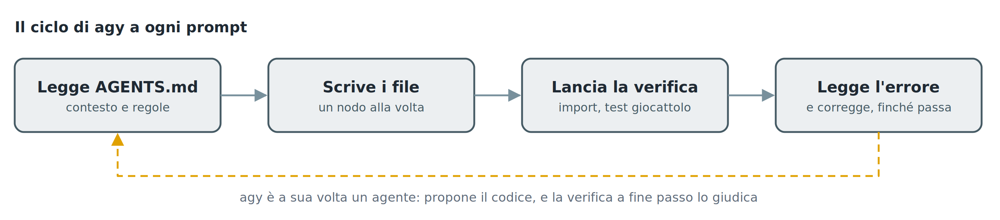

Il file `AGENTS.md` nella radice del progetto risolve il problema: Antigravity lo legge all'avvio di ogni sessione. Contiene il grafo da costruire, le API di ADK 2.x verificate su una versione reale, l'API del sito delle Olimpiadi e le regole del gioco.

Crea `AGENTS.md` con questo contenuto:

```markdown
# Progetto: oii-solver (ADK 2.x, Python)
Rete di agenti che risolve problemi OII di training.olinfo.it in Python e insegna a
migliorare il codice. Gira sulla macchina host: google-adk>=2.9 e Python sono già
installati. Non installare nulla.

## Due modalità, un grafo
- risolvi <task>: prima una v1 semplice e corretta, poi il Reviewer la migliora un passo alla volta.
- valuta <task> + codice dello studente (incollato o allegato .py): il codice dello
  studente è la v1; il sistema la verifica, la migliora a passi e scrive una guida.

## Grafo obiettivo
START → intake → download_task → reader → route_mode
route_mode: risolvi → (quick_solver ∥ test_author) → join → test_runner
            valuta  → test_author_v → test_runner
test_runner: rework → reviewer → test_runner
             done_solve → ask_approval → handle_approval: submit | stop
             done_teach → tutor → render_report
             give_up → give_up
submit e stop → render_report
Nodi LLM: reader, quick_solver, test_author, test_author_v, reviewer, tutor. Gli altri: codice.

## Versioni e file
- state["candidate"] = {title, why, complexity, code}: la versione in prova.
- state["history"] = tutte le prove, anche fallite: {v, title, why, complexity, esito,
  controesempio, tempi per subtask, punteggio stimato}.
- state["best"] = la versione corretta con il punteggio stimato più alto.
- work/<task>/: testo e allegati scaricati; work/<task>/testkit.json: test condivisi.
- work/<task>/<modalità>/: v<N>.py, tabellone.json, guida.md, report.html.

## API ADK 2.x (verificate su 2.9.2)
- from google.adk import Agent, Event, Workflow
  from google.adk.workflow import JoinNode
  from google.adk.events import RequestInput
- NON usare le API 1.x (SequentialAgent, ParallelAgent, LoopAgent).
- Workflow(name=..., edges=[...]); ogni edge è una catena:
  ("START", a, b) · routing: (b, {"x": c, "y": d}) · ciclo: (c, b)
  · routing verso un fan-out: (b, {"x": (p, q)}), poi (p, j), (q, j), (j, z) con j = JoinNode(name="j")
- Un nodo con più archi in ingresso parte a ogni trigger; JoinNode aspetta tutti.
- Nodo funzione: funzione Python (anche generatore). Parametri: ctx, node_input.
  Emette Event(state={...}, message="...", output=..., route="..."). ctx.state è modificabile.
- Nodo LLM: Agent(name, model, instruction, output_schema=Pydantic, output_key="k").
  instruction può essere una funzione (ctx) -> str: usala quando inietti codice.
- Human-in-the-loop: yield RequestInput(message=...); il nodo dopo riceve la risposta.
- Il Workflow copia gli Agent: non modificarli dopo averlo creato.
- adk web: oii_solver/__init__.py con "from . import agent"; root_agent in agent.py.
  adk web --reload_agents ricarica gli agenti quando cambia il codice.
- Modelli da .env: FAST_MODEL, STRONG_MODEL (default gemini-3.5-flash).

## API training.olinfo.it (non documentata, dal client @olinfo/training-api)
POST JSON a https://training.olinfo.it/api/<endpoint> → {"success":1,...} o {"success":0,"error"}
- task {action:"get", name} → title, task_type, time_limit (s), memory_limit (byte),
  statements {lingua: digest}, attachments [[nome, digest]], submission_format, supported_languages
- File e allegati: https://training.olinfo.it/files/<digest>/<nome>
- Pagina pubblica https://training.olinfo.it/task/<nome>: titolo, limiti, input/output, allegati.
  Se l'API non risponde, leggi i dati da qui. I linguaggi ammessi si vedono solo dopo il login.
- user {action:"login", username, password, keep_signed:false} → cookie training_token
- submission {action:"new", task_name, files:{<formato>:{data:base64, filename, language}}} → id
- submission {action:"details", id} → compilation_outcome, evaluation_outcome, score, score_details

## Regole
- Gli LLM propongono, il codice giudica: test e misure sono nodi deterministici.
- Soluzioni, brute force e generatori: Python 3, input/output su stdin/stdout
  (sys.stdin.buffer per leggere in fretta).
- Esecuzione: pypy3 se installato e ammesso dal task, altrimenti python3; sempre in una
  cartella temporanea con limiti di tempo, memoria e dimensione file (resource.setrlimit). Mai come root.
- Task adatti: input/output su stdin/stdout, template .py tra gli allegati, nessun grader C/C++ obbligatorio.
- Confronto output a token (split()).
- Ogni passo finisce con una verifica veloce.
- Tutto in italiano: messaggi, prompt, commenti.
```

<aside class="positive">
L'API di training.olinfo.it non è documentata: le chiamate sono ricavate dal client open source che usa il sito stesso, e il sito può cambiare senza preavviso. Per questo il downloader ripiega sulla pagina pubblica del task. Se qualcosa non torna, verifica prima questa sezione.
</aside>

## Come lavoreremo
Duration: 0:03:00

Il codelab procede in dieci passi, raggruppati in quattro atti. Ognuno segue lo stesso schema:

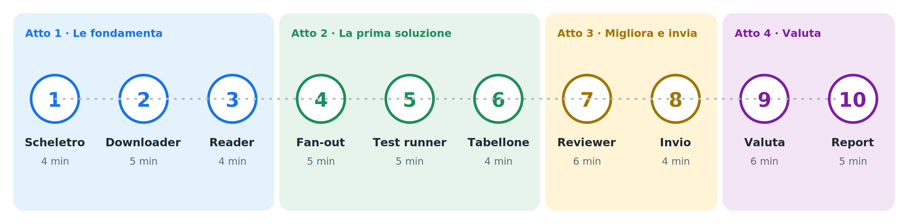

1. **Incolli il prompt** in agy.
2. **Leggi la spiegazione** mentre agy lavora: ti dice cosa sta succedendo e perché.
3. **Verifichi** in `adk web` che il sistema faccia la cosa nuova.

Dopo il passo 1 apri un secondo terminale nella stessa cartella e lascia girare:

```console
adk web --reload_agents
```

Apri `http://localhost:8000`, scegli `oii_solver` e usa una **nuova sessione** per ogni prova.

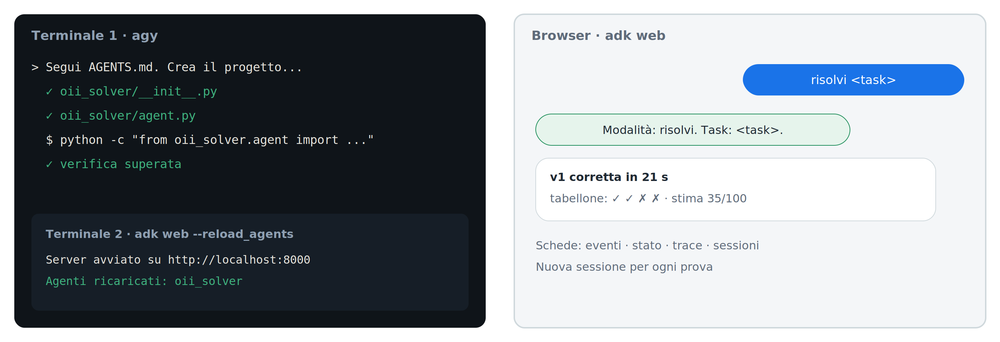

### Il grafo, passo dopo passo

All'inizio di ogni passo trovi il grafo com'è dopo quel passo: **in blu** i nodi che aggiungi, pieni quelli già costruiti, **grigi e tratteggiati** quelli che arriveranno.

### Salva una copia dopo ogni passo

Quando un passo funziona, salva una copia del progetto:

```console
cp -r ../oii-solver ~/snapshot/passo-N
```

Se un passo successivo rompe qualcosa che non riesci a riparare, torni alla copia e riprovi.

## Passo 1 · Scheletro e intake
Duration: 0:04:00

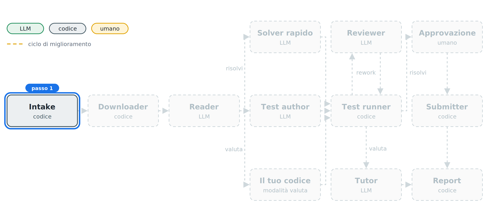

Il primo nodo del grafo non è intelligente, ed è voluto: è una funzione Python. In ADK 2.0 un nodo può essere un agente oppure semplice codice. Questo decide solo se oggi risolviamo o insegniamo.

Incolla in agy:

```console
Segui AGENTS.md. Crea il progetto: pacchetto oii_solver per adk web, requirements.txt, .env.example con GOOGLE_API_KEY, FAST_MODEL, STRONG_MODEL, MAX_STEPS=4, MAX_FIX=3, STRESS_ITERS=60, OLINFO_DRY_RUN=1. Non toccare il file .env: esiste già.
Primo nodo: intake. Capisce la modalità dal messaggio: "risolvi <task>" oppure "valuta <task>" con il codice dello studente incollato in un blocco python o allegato come file .py. Gestisci node_input sia come testo sia come Content con parti inline. Salva modalità, task ed eventuale codice nello stato e rispondi con un riepilogo.
Verifica con python -c "from oii_solver.agent import root_agent".
```

### Verifica

Avvia `adk web --reload_agents` nel secondo terminale, poi scrivi `risolvi <task>`. Il sistema risponde con modalità e nome del task.

## Passo 2 · Downloader
Duration: 0:05:00

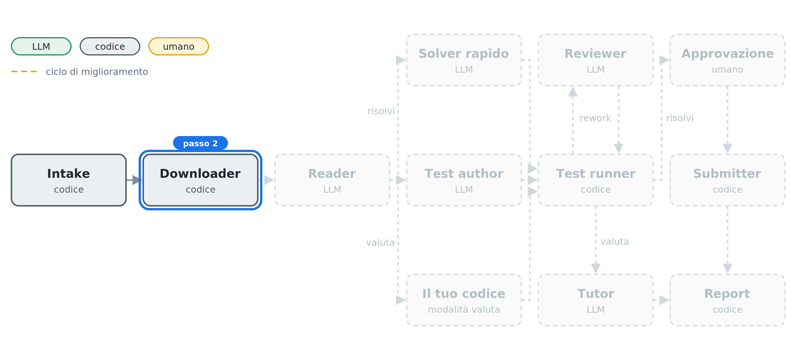

Il Downloader scarica il testo in PDF e gli allegati, e riconosce gli esempi. Il PDF passa al modello così com'è: Gemini legge formule e figure senza bisogno di estrarre il testo.

Il sito non documenta la sua API e può cambiarla: il Downloader prova prima l'API e, se non risponde, legge la pagina pubblica del task. Si ferma solo se il task non è adatto, e riusa i file già scaricati: meno attese, meno dipendenza dalla rete.

Incolla in agy:

```console
Scrivi oii_solver/olinfo.py con il client dell'API descritta in AGENTS.md e il nodo download_task. Prova prima l'API JSON; se non risponde o dà errore, usa la pagina pubblica https://training.olinfo.it/task/<task>: da lì leggi titolo, limiti di tempo e memoria, tipo di input/output, punteggio massimo e i link degli allegati (https://training.olinfo.it/files/<digest>/<nome>). Per il testo cerca nell'HTML il link al PDF, o i dati JSON che la pagina incorpora.
Scarica testo.pdf (italiano, altrimenti inglese) e gli allegati in work/<task>/, estraendo gli zip, e trova gli esempi input/output negli allegati. Se work/<task>/ contiene già testo e allegati, usali senza riscaricarli.
I linguaggi ammessi si vedono solo dopo il login: considera Python ammesso se tra gli allegati c'è un template .py, altrimenti scrivi "Python: da verificare all'invio" e continua. Fermati con un messaggio chiaro solo se l'input/output non è stdin/stdout o se serve un grader C/C++ senza un grader.py. Passa al nodo dopo un Content con il PDF e i sorgenti allegati. Prova su <task>.
```

### Verifica

In una nuova sessione scrivi `risolvi <task>`: compaiono titolo, limiti di tempo e memoria, allegati ed esempi trovati.

<aside class="negative">
In Linux agy esegue i comandi in una sandbox. Se la prova del downloader non raggiunge training.olinfo.it, lancia tu il test nel secondo terminale.
</aside>

## Passo 3 · Reader
Duration: 0:04:00

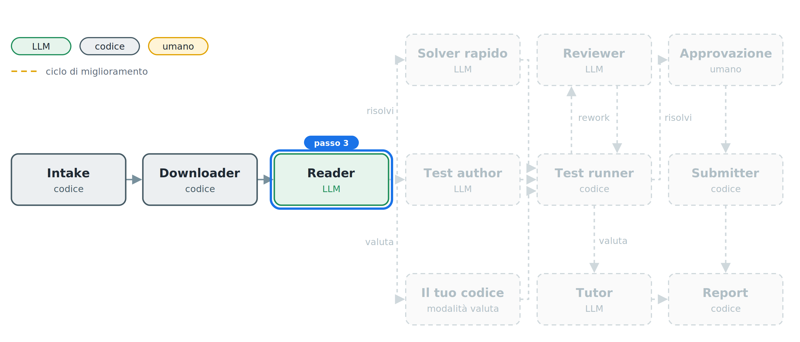

Il Reader è il primo agente LLM. Estrae, non risolve: trasforma il PDF in una specifica strutturata, validata da uno schema Pydantic. Fa quello che fa un concorrente nei primi due minuti: guarda i vincoli e capisce quale complessità serve.

Incolla in agy:

```console
Aggiungi l'agente reader (FAST_MODEL) con output_schema TaskSpec: summary, io_format, constraints, subtasks [{punti, vincoli, n_max}], target_complexity, edge_cases, examples [{input, output}]. Deve estrarre, non risolvere; gli esempi vanno trascritti alla lettera.
Poi il nodo route_mode: salva la spec nello stato, mostra in chat una tabella dei subtask con punti e limiti, e fa route "risolvi" o "valuta" in base alla modalità. Per ora collega solo "risolvi" a un nodo provvisorio che risponde "pronto". Verifica con un import.
```

### Verifica

Compare la tabella dei subtask con punti e limiti: è la mappa dei punti del problema.

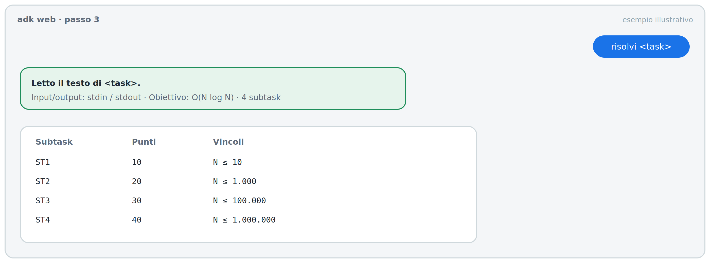

## Passo 4 · Solver rapido e Test author in parallelo
Duration: 0:05:00

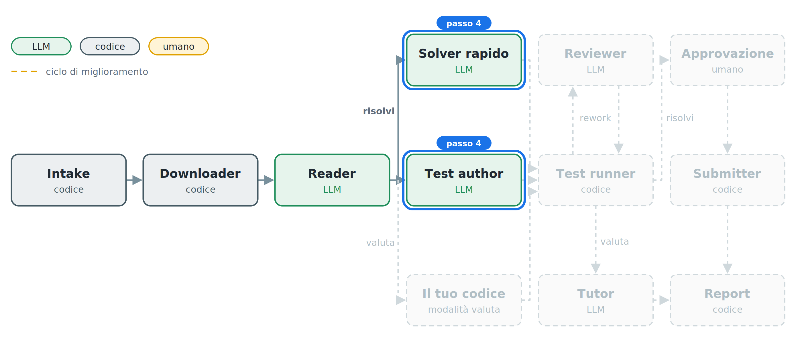

Qui il grafo si apre in due rami paralleli, uniti da un `JoinNode`.

* Il **Solver rapido** ha un solo obiettivo: una soluzione corretta, subito, anche se lenta.
* Il **Test author** costruisce gli strumenti per smascherarla: brute force e generatori. Non vede mai la soluzione.

L'indipendenza è il punto chiave: se due agenti sbagliano, sbagliano in modo diverso, e uno smaschera l'altro.

Incolla in agy:

```console
Sostituisci il nodo provvisorio con un fan-out, seguito da un JoinNode:
- quick_solver (FAST_MODEL): la soluzione Python più semplice che sia sicuramente corretta, anche lenta; niente ottimizzazioni, deve rispondere in fretta. Output Candidate {title, why, complexity, code}, output_key "candidate".
- test_author (FAST_MODEL): output TestKit {brute_code, gen_code, subtask_gen_code}, output_key "testkit". La brute è Python ovviamente corretto. gen_code produce un input piccolo casuale con il seed in argv[1], spesso con casi limite. subtask_gen_code, dato l'indice k in argv[1], stampa l'input più grande e più lento del subtask k. Non vede mai la soluzione.
Dopo il join, un nodo provvisorio che mostra titolo e complessità della v1. Verifica con un import.
```

### Verifica

Arriva la v1 con titolo e complessità. Nella vista degli eventi di `adk web` si vede che i due rami sono partiti insieme.

## Passo 5 · Test runner
Duration: 0:05:00

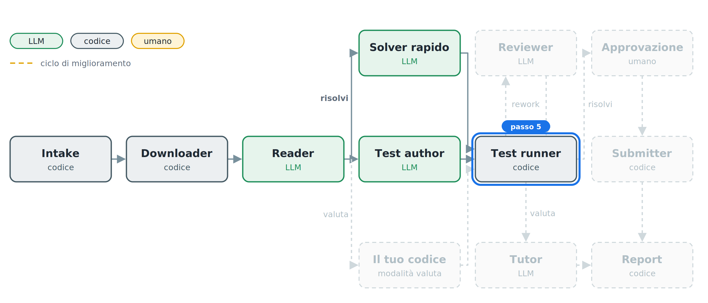

Il Test runner è il giudice, e non contiene nessun LLM. Prova la versione sugli esempi, poi su input casuali confrontati con la brute force: lo stress test che un concorrente fa a mano.

I test vengono salvati la prima volta e riusati nelle esecuzioni successive sullo stesso task. Così due esecuzioni, o il tuo codice e quello del sistema, si misurano sugli stessi identici input.


Incolla in agy:

```console
Scrivi oii_solver/judge.py, senza LLM: esegue un programma Python in una cartella temporanea con i limiti di AGENTS.md e confronta gli output a token.
Sostituisci il nodo provvisorio con test_runner: prova il candidato sugli esempi, poi su STRESS_ITERS input casuali contro la brute force (solo se la brute passa gli esempi). test_runner usa work/<task>/testkit.json se esiste; altrimenti salva lì il TestKit appena prodotto.
Se il candidato sbaglia, tieni il controesempio più corto, registralo in history, salva il motivo in state["rework_reason"] = "fix" e fai route "rework"; per ora collega "rework" a un nodo che mostra il controesempio. Se è corretto, salva work/<task>/<modalità>/v1.py e scrivi "v1 corretta" con i secondi trascorsi dall'inizio.
Verifica judge.py su un problema giocattolo (somma di N numeri): una soluzione giusta e una sbagliata.
```

### Verifica

Compare «v1 corretta in N secondi». Se invece compare un controesempio, hai visto il giudice al lavoro: è esattamente il bug che avresti trovato con uno stress test.

## Passo 6 · Il tabellone
Duration: 0:04:00


Corretta non basta: quanto vale? Per ogni subtask il Test runner genera il caso peggiore e cronometra la versione contro il limite di tempo del task. Il punteggio stimato è la somma dei punti dei subtask che entrano nel limite.

È una stima: il grader ufficiale gira su un'altra macchina.


Incolla in agy:

```console
Estendi test_runner con il benchmark: per ogni subtask genera l'input con subtask_gen_code e misura il tempo del candidato contro il time limit del task. Un subtask passa se sta nel limite; il punteggio stimato è la somma dei punti dei subtask che passano.
Tieni in stato history e best come in AGENTS.md. Mostra in chat il tabellone: versione, titolo, complessità, tempo per subtask con ✓ o ✗, punteggio stimato. Verifica con un import.
```

### Verifica

Compare il tabellone della v1: di solito corretta ma lenta, con punti solo sui subtask piccoli.

## Passo 7 · Il Reviewer iterativo
Duration: 0:06:00

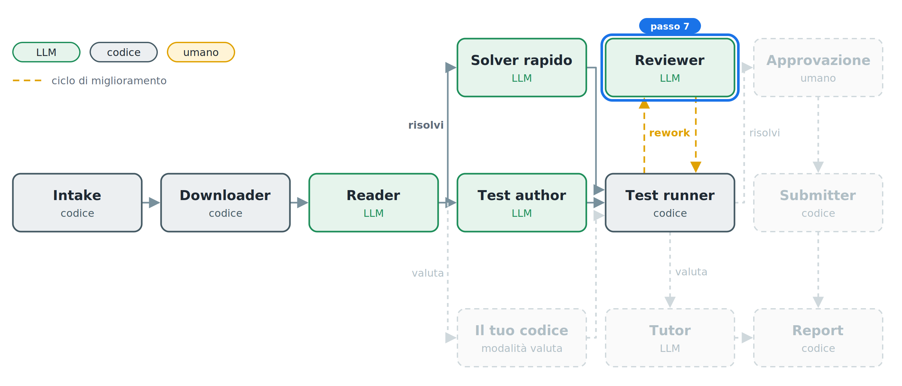

È il cuore del sistema. Il Reviewer non si limita a giudicare: implementa. A ogni giro sceglie **un solo** miglioramento, quello più utile per il prossimo subtask che non passa, e lo motiva con le misure del tabellone.

Ogni nuova versione torna al Test runner. Se è sbagliata, il controesempio torna al Reviewer, che corregge solo il bug. Due limiti impediscono al ciclo di girare all'infinito: `MAX_STEPS` miglioramenti e `MAX_FIX` correzioni fallite di fila.

Incolla in agy:

```console
Aggiungi l'agente reviewer (STRONG_MODEL, output_key "candidate") con output Step {review, title, why, complexity, code}. L'istruzione è una funzione che include spec, codice attuale, tabellone e, se c'è, il controesempio.
Regole per il reviewer: un solo miglioramento per passo, il più utile per il prossimo subtask che non passa; nel why il collo di bottiglia misurato; niente riscritture da zero se non servono. Con un controesempio corregge solo il bug.
Archi: test_runner --rework--> reviewer --> test_runner. test_runner fa rework con motivo "improve" finché il punteggio stimato non è pieno e i passi sono meno di MAX_STEPS. Dopo MAX_FIX correzioni fallite di fila riparte dalla versione best. Alla fine fa route "done_solve" verso un nodo che mostra il tabellone finale. Se non esiste nessuna versione corretta, fa route "give_up" con l'ultimo problema.
Salva ogni versione corretta in work/<task>/<modalità>/v<N>.py e, alla fine, il tabellone in work/<task>/<modalità>/tabellone.json. Verifica con un import.
```

### Verifica

In una nuova sessione scrivi `risolvi <task>` e osserva il tabellone crescere: ogni riga dice cosa è cambiato, perché, e quanti punti vale adesso.

## Passo 8 · Approvazione e invio
Duration: 0:04:00

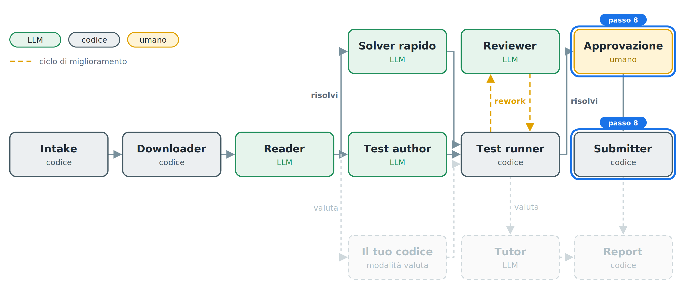

Un agente che agisce nel mondo reale deve chiedere il permesso. `RequestInput` mette in pausa il grafo finché un umano non risponde: senza «invia» non parte nessuna sottoposizione.

Incolla in agy:

```console
Sostituisci il nodo finale di "done_solve" con il cancello umano: ask_approval fa RequestInput con il tabellone e chiede di scrivere «invia»; se la risposta lo contiene vai a submit, altrimenti a stop.
submit: con OLINFO_DRY_RUN=1 simula soltanto. Altrimenti fa login con le credenziali in .env e legge i linguaggi ammessi, visibili solo dopo il login: se Python non c'è, si ferma e lo dice; se c'è, invia la versione best, in PyPy se ammesso, altrimenti Python 3. Attende l'esito e mostra, per ogni subtask, il punteggio ufficiale accanto a quello stimato. Verifica con un import.
```

### Verifica

In una nuova sessione scrivi `risolvi <task>`. Alla fine del ciclo il sistema si ferma e chiede conferma: scrivi `invia`.

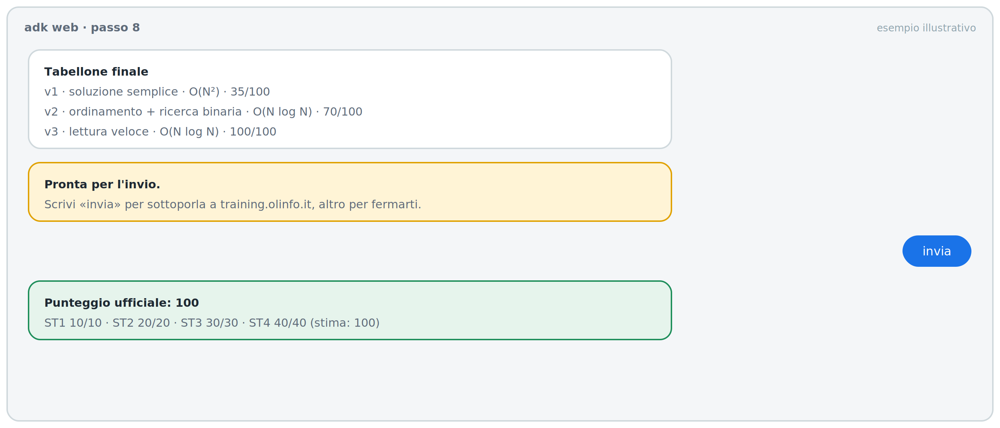

<aside class="negative">
Per l'invio reale usa un account dedicato agli esperimenti, mai quello di un concorrente: i punteggi finiscono nella classifica pubblica. Finché non sei sicuro, lascia <code>OLINFO_DRY_RUN=1</code>. Il sito può cambiare anche l'API di invio: prova l'invio reale prima dell'uso, con l'account dedicato.
</aside>

## Passo 9 · Valuta il tuo codice
Duration: 0:06:00

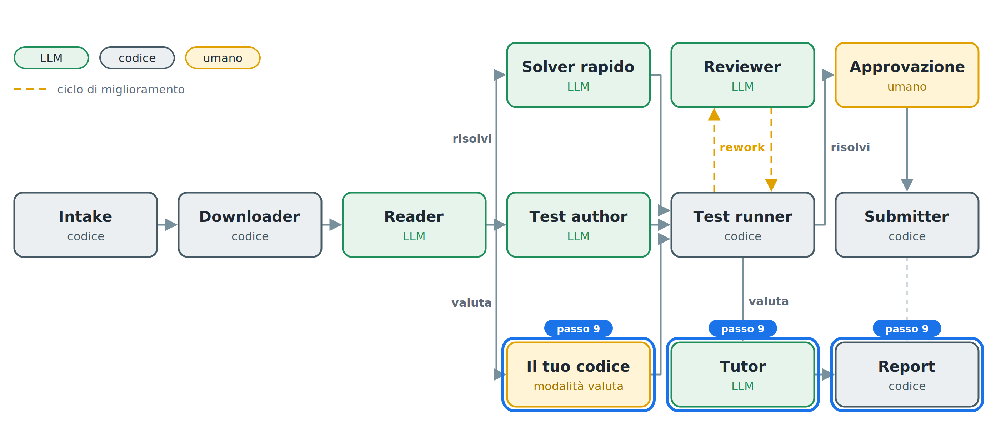

Stessa rete, ruolo diverso: invece di risolvere, insegna. In modalità `valuta` la v1 è il codice dello studente. Il sistema lo verifica, lo migliora a passi con lo stesso ciclo del passo 7 e alla fine il **Tutor** trasforma la storia delle versioni in una guida.

Ogni passo della guida corrisponde a una versione che ha superato i test: la guida non può consigliarti qualcosa che non funziona. Se hai già eseguito `risolvi` sullo stesso task, la review confronta il tuo codice con la versione migliore del sistema, sugli stessi input.

Incolla in agy:

```console
Collega la route "valuta" di route_mode a test_author_v, una copia di test_author con un altro nome, e da lì a test_runner: in questa modalità la v1 è il codice dello studente, già nello stato. In modalità valuta, test_runner chiude con route "done_teach" invece di "done_solve".
Aggiungi l'agente tutor (STRONG_MODEL) su "done_teach" con output_schema Guide: review (corretto o no, complessità, cosa lo rallenta), steps [{v, obiettivo, perche, suggerimento, come_verificare}] uno per ogni versione della storia, chiusura. Ogni step deve riferirsi a una versione che ha superato i test. Se esiste work/<task>/risolvi/tabellone.json, la review include un confronto subtask per subtask tra il codice dello studente e la versione migliore del sistema, sugli stessi input; il codice del sistema compare solo in fondo.
Dopo il tutor, un nodo render_report senza LLM che per ora scrive work/<task>/valuta/guida.md dalla Guide e la mostra in chat. Verifica con un import.
```

### Verifica

In una nuova sessione scrivi `valuta <task>` e allega il tuo file `.py`, oppure incolla il codice in un blocco python. Alla fine compare la guida.

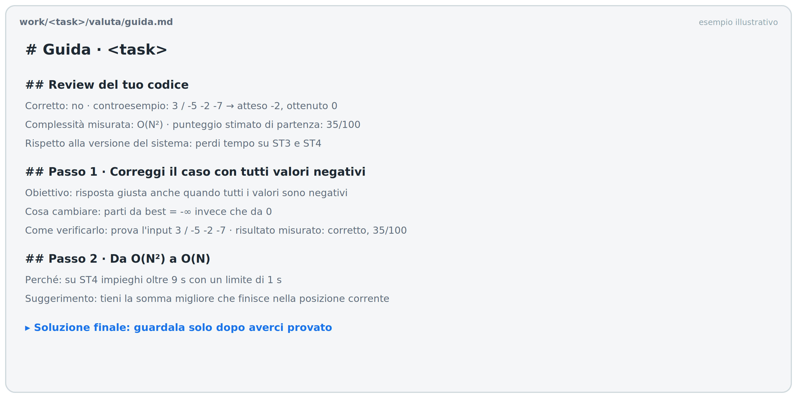

<aside class="positive">
Non hai una tua soluzione? Usa la <code>v1.py</code> prodotta dal passo 7: è corretta ma lenta, perfetta per vedere la guida all'opera. Per vedere anche una correzione, introduci un bug su un caso limite.
</aside>

## Passo 10 · La vista visiva
Duration: 0:05:00

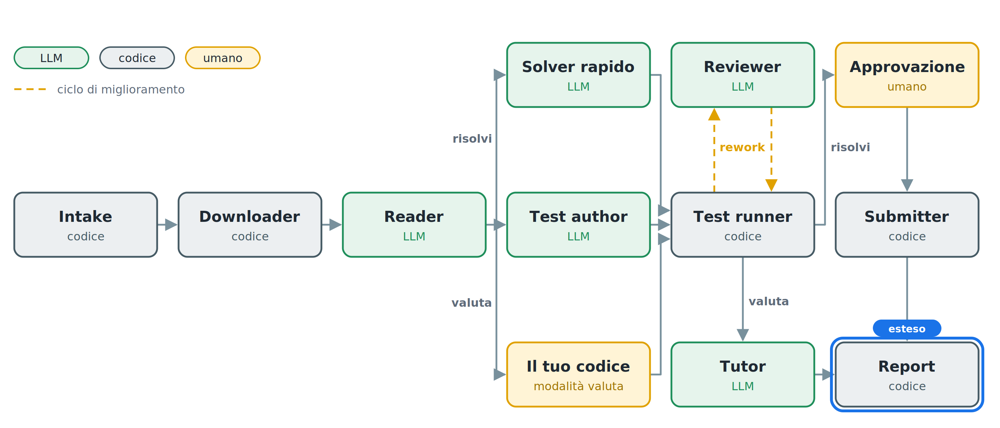

La guida in testo dice cosa cambiare; la vista visiva lo mostra. Il nodo `render_report`, senza LLM, costruisce una pagina HTML con:

* il grafico dei tempi per subtask di ogni versione, con la linea del limite di tempo;
* il diff affiancato tra una versione e la successiva, generato da `difflib.HtmlDiff` della libreria standard;
* i controesempi delle correzioni;
* la spiegazione del Tutor accanto a ogni diff.

Il diff non lo scrive il modello: è la differenza reale tra due versioni che hanno superato i test.

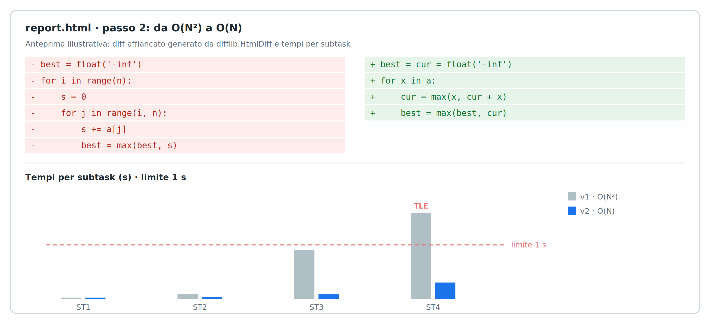

Incolla in agy:

```console
Estendi render_report, sempre senza LLM. Oltre a guida.md scrive in work/<task>/<modalità>/ report.html, una pagina unica senza dipendenze esterne, con:
1) intestazione con task, punteggio stimato iniziale e finale;
2) grafico SVG dei tempi per subtask di ogni versione, con la linea del time limit e ✓/✗;
3) per ogni passo: spiegazione del tutor, diff affiancato tra versione precedente e nuova fatto con difflib.HtmlDiff (solo righe cambiate, 3 di contesto), risultato misurato;
4) per le correzioni, il controesempio: input, output atteso, output ottenuto;
5) la soluzione finale chiusa in un <details> "guardala dopo averci provato".
Collega anche submit e stop a render_report: in modalità risolvi usa il why del reviewer al posto della spiegazione del tutor. In chat mostra il percorso di report.html. Verifica generando il report dalla storia di un'esecuzione precedente.
```

### Verifica

Apri nel browser il file `report.html` indicato in chat. Scorri i passi: per ognuno vedi cosa è cambiato nel codice e come sono cambiati i tempi.

## Se qualcosa va storto
Duration: 0:03:00

### Un nodo dà errore

Incolla in agy:

```console
Il nodo <nome> dà questo errore: <incolla>. Correggi solo quel nodo, senza toccare il resto.
```

### Un passo non si recupera

Chiudi agy, ripristina la copia dell'ultimo passo riuscito e riparti:

```console
cd .. && rm -rf oii-solver && cp -r ~/snapshot/passo-N oii-solver && cd oii-solver
```

Riapri agy e scrivi: «Ho ripristinato il progetto al passo N: rileggi i file e continuiamo dal passo N+1.»

### Altri problemi comuni

* **adk web non vede le modifiche:** riavvialo nel secondo terminale.
* **Il downloader rifiuta il task:** controlla nella pagina pubblica che l'input/output sia stdin/stdout e che non serva un grader C/C++.
* **Il downloader non trova testo o allegati:** il sito può essere cambiato. Con il prompt jolly chiedi ad agy di aprire la pagina pubblica del task e di adattare il parser.
* **Il ciclo del Reviewer non migliora il punteggio:** prova un modello più forte in `STRONG_MODEL`, oppure aumenta `MAX_STEPS`.
* **La brute force è troppo lenta anche sugli input piccoli:** chiedi al Test author di ridurre la dimensione degli input di `gen_code`.

## Complimenti
Duration: 0:02:00


Hai costruito una rete di dieci nodi che risolve problemi reali delle Olimpiadi e insegna a migliorare il codice, senza scrivere a mano una riga del sistema.

### Cosa hai imparato

* Un sistema multi-agente in ADK 2.0 è un grafo: nodi LLM e nodi di codice, collegati da archi, route e cicli.
* Gli LLM propongono e il codice giudica: correttezza e velocità si misurano, non si dichiarano.
* Due agenti indipendenti si controllano a vicenda meglio di uno solo.
* Un buon ciclo di miglioramento cambia una cosa alla volta e la misura.
* Prima di agire nel mondo, un agente chiede il permesso.

### Prossimi passi

* Prova la modalità `valuta` sulle tue soluzioni di gara: il confronto con la versione del sistema, sugli stessi input, ti dice dove perdi tempo.
* Aggiungi il supporto ai task con grader Python.
* Documentazione di ADK 2.x: [adk.dev](https://adk.dev)
* Problemi per allenarti, tu e i tuoi agenti: [training.olinfo.it](https://training.olinfo.it)
